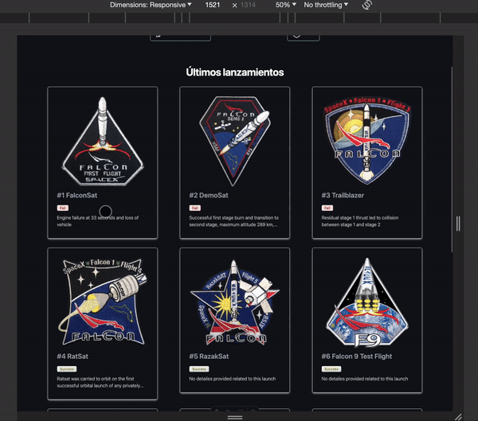

# Space X Launches 🚀 - An Astro App

## 📚 About
Based on the [Astro midudev](https://www.youtube.com/watch?v=RB5tR_nqUEw) tutorial, this is a simple responsive app made with [Astro](https://astro.build/), a modern front-end framework for faster websites, to display SpaceX launches. It uses the [SpaceX API](https://github.com/r-spacex/SpaceX-API/tree/master/docs) to fetch the data and display it in a modern, responsive, and SEO-friendly way.





## 🚀 Project Structure

Inside of your Astro project, you'll see the following folders and files:

```text
├── package.json
├── public
│   └── favicon.svg
├── src
│   ├── components
│   │   ├── Header
│   │   │   ├── Header.astro
│   │   │   ├── HeaderButton.astro
│   │   │   └── HeaderIcon.astro
│   │   ├── Launches
│   │   │   ├── LaunchCard.astro
│   │   │   ├── LaunchDetails.astro
│   │   │   └── Launches.astro
│   │   └── Shared
│   │       └── StatusBadge.astro
│   ├── env.d.ts
│   ├── layouts
│   │   ├── Layout.astro
│   │   └── LayoutMarkdown.astro
│   ├── pages
│   │   ├── about.md
│   │   ├── index.astro
│   │   └── launch
│   │       └── [id].astro
│   ├── services
│   │   └── spacex.ts
│   ├── types
│   │   └── api.ts
│   └── utils
│       └── date.ts
├── tailwind.config.mjs
└── tsconfig.json
```

## 🧞 Commands

All commands are run from the root of the project, from a terminal:

| Command                   | Action                                           |
| :------------------------ | :----------------------------------------------- |
| `nvm use`                 | Set node version                                 |
| `npm install`             | Installs dependencies                            |
| `npm run dev`             | Starts local dev server at `localhost:4321`      |
| `npm run build`           | Build your production site to `./dist/`          |
| `npm run preview`         | Preview your build locally, before deploying     |
| `npm run astro ...`       | Run CLI commands like `astro add`, `astro check` |
| `npm run astro -- --help` | Get help using the Astro CLI                     |
